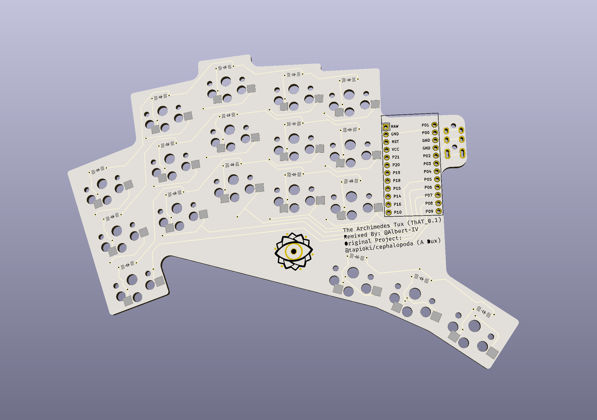

# Archimedes Tux Keyboard

Based off the excellent [Architeuthis Dux keyboard](https://github.com/tapioki/cephalopoda/tree/main/Architeuthis%20dux), the goal is to add a third thumb key and see where else this takes me.

Built with [Ergogen](https://github.com/mrzealot/ergogen).

##### Rev 0.1 - Sent to AllPCB

* AllPCB came back asking about the drilling holes.  Apparently one of them went through one of the TRRS pads, so I told them to just not cut that one out. The rest of the drilling holes are not through any pads or anything important
* PCB's shipped
* PCB's Arrived and Built
* Confirmed working via QMK!

## Rev 0.2

**WIP** - Currently only in `output` folder and completely unrouted.

## Ideas / Goals

- [ ] Make Pro Micro footprint reversible
  - [x]  Add footprint to repo
  - [x]  Rotate footprint
  - [x]  Add additional row of pins for Nice!Nano
  - [ ]  Add representation of the USB cutout / area
  - [ ]  Change pads to match Ergogen
  - [ ]  Convert footprint to Erogogen footprint
  - [ ]  Add PR to Erogogen
  - [ ]  Add / place on board
- [ ] On / Off routing for battery with support for [[Nice!Nano]] battery pins
- [ ] Mousebites on TRRS jack (removable TRRS socket for better [[Nice!Nano]] support)
- [ ] Mousebites on third thumb key?
- [ ] Change routing in bottom area to allow for larger silkscreen eye

v0.1 -> v0.2

- [x] Swap pins on row connections to make routing easier
- [x] Add reset switch / pads
- [x] Fix edge cuts / drilling.  (Tapi believes this is an issue due to the multiple fillets / outlines in the Ergogen script)
- [x] Rename repo / files
- [x] Re-add solder locations for switches instead of only hotswap
- [x] Rotate thumbs to allow 1.5u / 2u keycaps
- [x] Re-add Puck support
  - [x]  Add initial footprint to library
  - [x]  Fix text when rotation makes the text apppear in the wrong order
  - [x]  Make each individual screw hole able to be turned on / off
  - [x]  Add PR to Erogogen
  - [x]  Add / place puck on board

### To Run Locally

**If you do not have Node.js installed** 

Install using [the installer](https://nodejs.org/en/download/) [NVM,](https://github.com/nvm-sh/nvm) or [Chocolatey](https://community.chocolatey.org/packages/nodejs-lts) depending on your platform.  Using the installer usually leads to permission issues with NPM so it's suggested to use either NVM or chocolatey if you don't want to mess with it too much.

Once this is installed run `npm i -g npm` to upgrade NPM to the latest version.

**After Node.js is installed**

Run `npm run patch-footprints` in the base directory.  This is updates one of the footprints to allow for SMD or through-hole only diodes.

